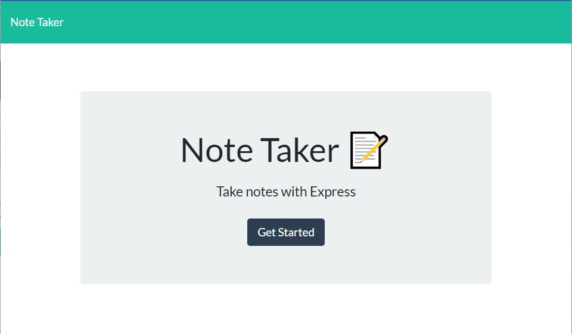

# TAKING NOTES  
  
  ## Description

  An application to create a simple notes or to-dos with a one line description.  Notes can be saved, reviewed, or deleted.

  ## Table of Contents (Optional)

 - [Usage](#usage)
 - [Questions](#questions)
 - [License](#license)

  ## Usage

 - Access the app at [TAKING NOTES](https://github.com/ladytrell/team-directory) 
 - Click get started
 - Type in new note title and text
 - Click the save icon in the upper right corner
 - Saved notes can reviewed by clicking them to bring it back to main window.
 - Click the + icon to return blank note entry
 - Click the waste basket to remove a note

  ## Demo Images
  
  
  

  ## Questions

  GitHub: [ladytrell](https://github.com/ladytrell)

  Email: [antrellkent@gmail.com](mailto:antrellkent@gmail.com)

   
  ## License

  [MIT](https://opensource.org/licenses/MIT)
  

